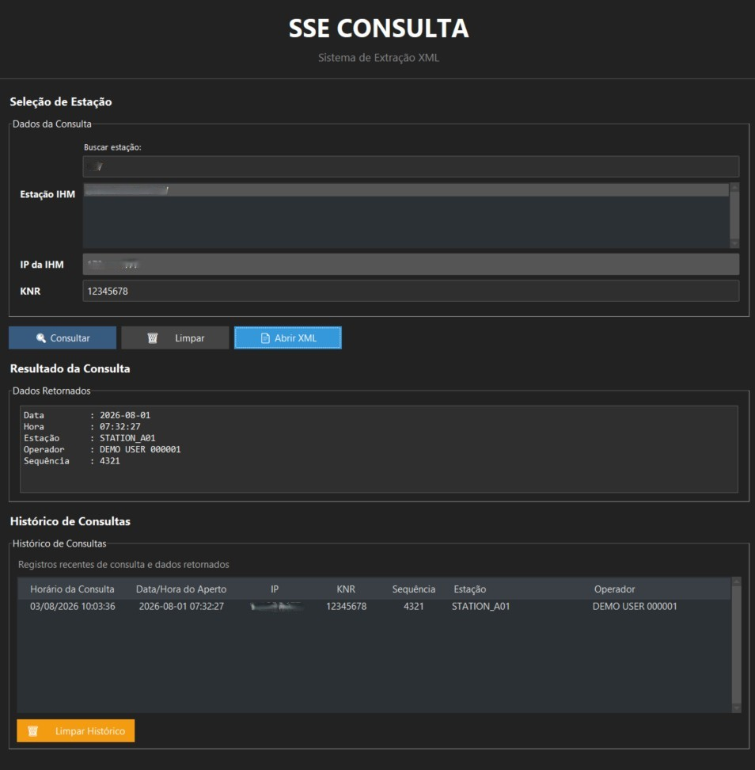
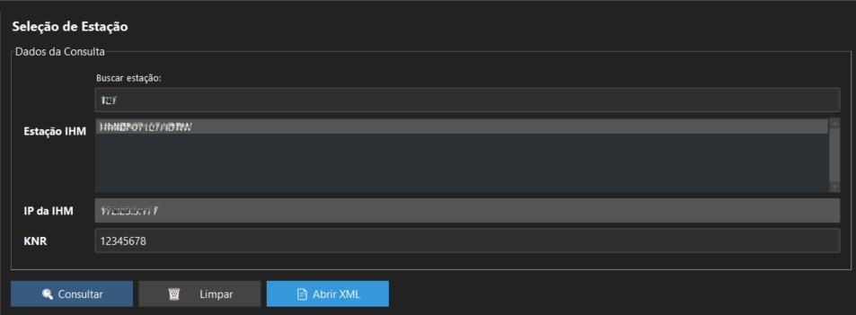
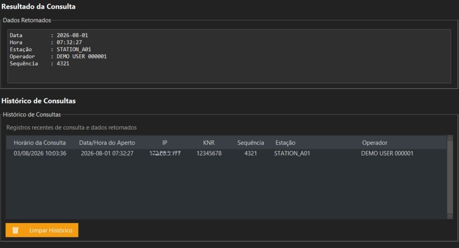
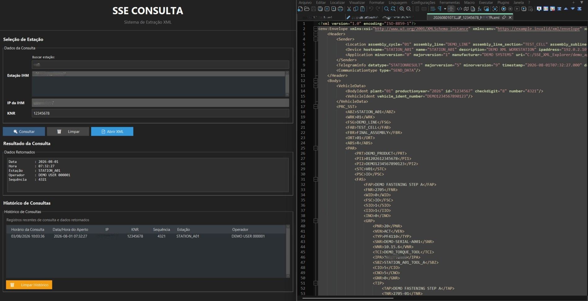

# Industrial XML Extraction Tool

Desktop application developed in Python to search and extract production information directly from XML files stored on industrial workstations.

The project was created as a contingency tool for manufacturing environments where centralized traceability systems may become temporarily unavailable. Instead of relying on the central server, the application locates XML files directly on the workstation, extracts the required information and presents it through a simple desktop interface.

---

## Overview

SSE XML Explorer allows engineers and support analysts to quickly retrieve manufacturing data by searching a workstation and a KNR identifier.

The application automatically locates the XML, extracts the relevant information and keeps a searchable history of previous queries.

---

# Interface

## Main Application



---

## Search Process



---

## Search Result



---

## XML Inspection



---

# Features

- XML search by KNR
- Automatic workstation lookup
- Network folder access
- XML parsing
- Operator identification
- Sequence extraction
- Local search history
- XML viewer integration
- Dark interface
- Responsive desktop application

---

# Architecture

```text
Operator
    │
    ▼
Desktop Application (Tkinter)
    │
    ▼
Network Share
    │
    ▼
Locate XML
    │
    ▼
Parse XML
    │
    ▼
Extract Information
    │
    ├── Operator
    ├── Sequence
    ├── Station
    ├── Timestamp
    └── KNR
    │
    ▼
Results Screen
```

---

# Technologies

- Python
- Tkinter
- XML
- ElementTree
- JSON
- Windows Network Share
- Threading

---

# Project Structure

```text
SSE-XML-Explorer
│
├── config/
├── images/
├── utils/
├── app.py
├── network_reader.py
├── xml_parser.py
├── logger.py
├── requirements.txt
└── README.md
```

---

# How it Works

1. Select the workstation.
2. Enter the KNR.
3. The application connects to the workstation.
4. The corresponding XML file is located.
5. XML data is parsed.
6. Relevant production information is extracted.
7. Results are displayed.
8. The query is stored in the local history.

---

# Security

The public version of this repository does **not** contain:

- Production credentials
- Internal IP addresses
- Company data
- Manufacturing identifiers
- Original XML files

All screenshots and XML examples were replaced with fictitious demonstration data before publication.

---

# Future Improvements

- Advanced XML visualization
- Export to CSV
- Search filters
- Multi-workstation search
- Parallel processing
- Automatic XML indexing
- Improved search performance

---

# License

MIT License
